# ☕ Java Basics – IIBS Training

<div align="center">


### 🚀 *Master Java Programming from Scratch!*

**Welcome to your comprehensive Java learning journey!**  
Everything you need to become a confident Java developer, explained with crystal-clear examples.

[📚 Start Learning](#-learning-path) • [💻 Practice](#-exercises--practice) • [📝 Assignments](#-assignments) • [🎯 What's Next](#-whats-coming-next)

---

</div>

## 🎯 Quick Navigation

<table>
<tr>
<td width="33%" align="center">

### 📖 **Fundamentals**
Learn the core concepts

[Jump to Topics →](#-topics-covered)

</td>
<td width="33%" align="center">

### 💪 **Practice**
Sharpen your skills

[View Exercises →](#-exercises--practice)

</td>
<td width="33%" align="center">

### 🏆 **Assignments**
Test your knowledge

[See Assignments →](#-assignments)

</td>
</tr>
</table>

---

## 📊 Learning Progress

```
Completed Topics:
████████████████████████████████ 100%

✅ JDK, JRE & JVM
✅ Output Methods
✅ Variables
✅ Data Types
✅ User Input (Scanner)
✅ Operators
✅ Conditional Statements
✅ Strings & Characters
✅ Loops (for, while, do-while)
✅ Arrays
🟡 HackerRank Challenges (In Progress)
```

---

## 🗺️ Learning Path

```mermaid
graph LR
    A[🌱 Setup] --> B[📝 Basics]
    B --> C[🔢 Data & Variables]
    C --> D[⚙️ Operators]
    D --> E[🔀 Conditionals]
    E --> F[🔄 Loops]
    F --> G[📚 Arrays]
    G --> H[🏆 HackerRank]
    
    style A fill:#90EE90
    style B fill:#90EE90
    style C fill:#90EE90
    style D fill:#90EE90
    style E fill:#90EE90
    style F fill:#90EE90
    style G fill:#90EE90
    style H fill:#FFD700
```



---

## 🔬 Fundamentals

- **Completed:** `JDK, JRE & JVM`, `Output Methods`, `Variables`, `Data Types`, `User Input (Scanner)`, `Operators`, `Conditional Statements`, `Strings & Characters`, `Loops`, `Arrays`
- **In Progress:** `HackerRank Challenges`
- **Next Phase:** Advanced OOP, Exception Handling, Collections

> Quick intro: These fundamentals are the building blocks. You've now mastered core programming concepts! Next, master problem-solving with HackerRank challenges.


## 📚 Topics Covered

<details open>
<summary><h3>🔧 1. JDK, JRE & JVM - The Foundation</h3></summary>

> **Understanding how Java works under the hood**

```
┌─────────────────────────────────────────┐
│              JDK (Dev Kit)              │
│  ┌───────────────────────────────────┐  │
│  │        JRE (Runtime Env)          │  │
│  │  ┌─────────────────────────────┐  │  │
│  │  │     JVM (Virtual Machine)   │  │  │
│  │  │   - Executes Bytecode       │  │  │
│  │  │   - Platform Independent    │  │  │
│  │  └─────────────────────────────┘  │  │
│  │  + Java Libraries                 │  │
│  └───────────────────────────────────┘  │
│  + Compiler (javac)                     │
│  + Development Tools                    │
└─────────────────────────────────────────┘
```

| Component | Purpose | When You Need It |
|:---------:|:--------|:-----------------|
| **JDK** 🛠️ | Development Kit | Writing & compiling Java code |
| **JRE** ▶️ | Runtime Environment | Running Java applications |
| **JVM** 🖥️ | Virtual Machine | Executing bytecode |

**💡 Key Concept:** `.java` → **(compile)** → `.class` → **(JVM)** → **Execution**

</details>

<details open>
<summary><h3>🖨️ 2. Output in Java - Talking to the User</h3></summary>

```java
// Print with new line
System.out.println("Hello, Java World! 🌍");

// Print without new line
System.out.print("Welcome ");
System.out.print("to ");
System.out.println("Java!");

// Formatted output
System.out.printf("Name: %s, Age: %d%n", "Aarav", 20);
```

**🎨 Escape Sequences:**
- `\n` - New line
- `\t` - Tab space
- `\"` - Double quote
- `\\` - Backslash

</details>

<details open>
<summary><h3>📦 3. Variables - Storing Information</h3></summary>

> **Variables are containers that hold data**

```java
// Declaring and initializing variables
int age = 20;                    // Integer
String name = "Priya";           // Text
double cgpa = 8.7;               // Decimal
boolean isStudent = true;        // True/False
char grade = 'A';                // Single character
```

**📌 Naming Rules:**
- ✅ Start with letter, `$`, or `_`
- ✅ Use camelCase: `studentName`, `totalMarks`
- ❌ Can't use Java keywords: `int`, `class`, etc.
- ❌ Can't start with numbers

**Example:**
```java
int marks = 85;
marks = 90;  // Updating value
System.out.println("Updated marks: " + marks);
```

</details>

<details open>
<summary><h3>🎲 4. Data Types - Different Kinds of Data</h3></summary>

### **Primitive Types** (8 types)

| Type | Size | Range | Example |
|:----:|:----:|:------|:--------|
| `byte` | 1 byte | -128 to 127 | `byte age = 25;` |
| `short` | 2 bytes | -32K to 32K | `short year = 2025;` |
| `int` | 4 bytes | -2B to 2B | `int population = 1000000;` |
| `long` | 8 bytes | Very large | `long distance = 1234567890L;` |
| `float` | 4 bytes | Decimal | `float price = 99.99f;` |
| `double` | 8 bytes | Precise decimal | `double pi = 3.14159265359;` |
| `char` | 2 bytes | Single character | `char initial = 'A';` |
| `boolean` | 1 bit | true/false | `boolean passed = true;` |

### **Non-Primitive Types**

```java
String name = "Java Programming";    // Text
int[] numbers = {1, 2, 3, 4, 5};    // Array
```

**💡 Pro Tip:** Use `int` for whole numbers, `double` for decimals, `String` for text!

</details>

<details open>
<summary><h3>⌨️ 5. Taking Input - Interactive Programs</h3></summary>

```java
import java.util.Scanner;

public class InputExample {
    public static void main(String[] args) {
        Scanner sc = new Scanner(System.in);
        
        // Taking different types of input
        System.out.print("Enter your name: ");
        String name = sc.nextLine();
        
        System.out.print("Enter your age: ");
        int age = sc.nextInt();
        
        System.out.print("Enter your CGPA: ");
        double cgpa = sc.nextDouble();
        
        System.out.println("\n📋 Your Details:");
        System.out.println("Name: " + name);
        System.out.println("Age: " + age);
        System.out.println("CGPA: " + cgpa);
        
        sc.close();
    }
}
```

**🔑 Scanner Methods:**

| Method | Data Type | Example |
|:-------|:----------|:--------|
| `nextInt()` | Integer | `int num = sc.nextInt();` |
| `nextDouble()` | Decimal | `double price = sc.nextDouble();` |
| `nextLine()` | String (full line) | `String text = sc.nextLine();` |
| `next()` | String (single word) | `String word = sc.next();` |
| `nextBoolean()` | Boolean | `boolean flag = sc.nextBoolean();` |

**⚠️ Important:** `next()` reads only one word, `nextLine()` reads the entire line!

</details>

<details open>
<summary><h3>⚙️ 6. Operators - Performing Operations</h3></summary>

### **🔢 Arithmetic Operators**
```java
int a = 10, b = 3;
System.out.println(a + b);  // Addition: 13
System.out.println(a - b);  // Subtraction: 7
System.out.println(a * b);  // Multiplication: 30
System.out.println(a / b);  // Division: 3
System.out.println(a % b);  // Modulus (Remainder): 1
```

### **🔍 Relational Operators**
```java
int x = 5, y = 10;
System.out.println(x == y);  // Equal to: false
System.out.println(x != y);  // Not equal: true
System.out.println(x > y);   // Greater than: false
System.out.println(x < y);   // Less than: true
System.out.println(x >= 5);  // Greater or equal: true
System.out.println(y <= 10); // Less or equal: true
```

### **🧠 Logical Operators**
```java
boolean result1 = (5 > 3) && (8 > 5);  // AND: true
boolean result2 = (5 > 3) || (8 < 5);  // OR: true
boolean result3 = !(5 > 3);            // NOT: false
```

### **📝 Assignment Operators**
```java
int num = 10;
num += 5;   // num = num + 5  → 15
num -= 3;   // num = num - 3  → 12
num *= 2;   // num = num * 2  → 24
num /= 4;   // num = num / 4  → 6
num %= 4;   // num = num % 4  → 2
```

### **⬆️⬇️ Unary Operators**
```java
int count = 5;
count++;        // Post-increment: count = 6
++count;        // Pre-increment: count = 7
count--;        // Post-decrement: count = 6
--count;        // Pre-decrement: count = 5

// Difference example
int a = 5;
int b = a++;    // b = 5, then a = 6
int c = ++a;    // a = 7, then c = 7
```

</details>

<details open>
<summary><h3>🔀 7. Conditional Statements - Making Decisions</h3></summary>

### **🎯 if Statement**
```java
int marks = 75;
if (marks >= 40) {
    System.out.println("✅ You passed!");
}
```

### **🔄 if-else Statement**
```java
int age = 17;
if (age >= 18) {
    System.out.println("🎉 Eligible to vote!");
} else {
    System.out.println("⏳ Not eligible yet.");
}
```

### **🎚️ if-else-if Ladder**
```java
int score = 85;
if (score >= 90) {
    System.out.println("🌟 Grade: A+");
} else if (score >= 80) {
    System.out.println("⭐ Grade: A");
} else if (score >= 70) {
    System.out.println("✨ Grade: B");
} else if (score >= 60) {
    System.out.println("📝 Grade: C");
} else {
    System.out.println("📚 Need more practice!");
}
```

### **🎛️ switch Statement**
```java
int day = 3;
switch (day) {
    case 1:
        System.out.println("Monday 📅");
        break;
    case 2:
        System.out.println("Tuesday 📅");
        break;
    case 3:
        System.out.println("Wednesday 📅");
        break;
    case 4:
        System.out.println("Thursday 📅");
        break;
    case 5:
        System.out.println("Friday 📅");
        break;
    case 6:
    case 7:
        System.out.println("Weekend! 🎉");
        break;
    default:
        System.out.println("Invalid day ❌");
}
```

### **⚡ Ternary Operator (Shortcut)**
```java
int a = 10, b = 20;
int max = (a > b) ? a : b;  // max = 20
String result = (marks >= 40) ? "Pass ✅" : "Fail ❌";
```

**💡 When to use what:**
- `if-else` → 2-3 conditions
- `if-else-if` → Multiple ranges
- `switch` → Checking exact values
- `ternary` → Quick one-line decisions

</details>

<details open>
<summary><h3>🔤 8. Strings & Characters - Text Processing</h3></summary>

> **Work with text data and individual characters**

### **📝 String Declaration & Initialization**
```java
// Different ways to create strings
String str1 = "Hello Java";           // String literal
String str2 = new String("World");    // Using new keyword
String str3 = "";                     // Empty string

// Character vs String
char ch = 'A';         // Single character (single quotes)
String word = "Apple"; // String of characters (double quotes)
```

### **📏 String Length & Accessing Characters**
```java
String name = "Priya";

// Get length
int len = name.length();  // 5
System.out.println("Length: " + len);

// Access characters using index (0-based)
char first = name.charAt(0);      // 'P'
char last = name.charAt(4);       // 'a'
char atIndex = name.charAt(2);    // 'i'

System.out.println("First char: " + first);
System.out.println("Char at index 3: " + name.charAt(3));
```

### **🔤 String Built-in Methods**
```java
String text = "Java Programming";

// Case conversion
System.out.println(text.toUpperCase());   // JAVA PROGRAMMING
System.out.println(text.toLowerCase());   // java programming

// Check and find
System.out.println(text.contains("Java")); // true
System.out.println(text.indexOf("Java"));  // 0
System.out.println(text.indexOf("Pro"));   // 5
System.out.println(text.indexOf("xyz"));   // -1 (not found)

// Extract substring
System.out.println(text.substring(0, 4));    // "Java"
System.out.println(text.substring(5));       // "Programming"

// Replace characters/substrings
System.out.println(text.replace('a', '*'));        // J*v* Progr*mming
System.out.println(text.replace("Java", "Python")); // Python Programming

// Trim whitespace
String withSpaces = "  Hello  ";
System.out.println(withSpaces.trim());  // "Hello"

// Compare strings
String str1 = "hello";
String str2 = "hello";
System.out.println(str1.equals(str2));       // true (exact match)
System.out.println(str1.equalsIgnoreCase("HELLO")); // true
```

### **🔄 Character Operations**
```java
String str = "Hello123";

// Loop through each character
for (int i = 0; i < str.length(); i++) {
    char ch = str.charAt(i);
    System.out.println(ch);
}

// Using enhanced for with toCharArray()
for (char c : str.toCharArray()) {
    System.out.println(c);
}

// Check character types
String input = "Java2025";
int digits = 0, letters = 0;

for (char c : input.toCharArray()) {
    if (Character.isDigit(c)) {
        digits++;
    } else if (Character.isLetter(c)) {
        letters++;
    }
}
System.out.println("Letters: " + letters + ", Digits: " + digits);
```

### **✨ Common String Operations**
```java
// Count occurrences
String sentence = "banana";
int count = 0;
for (char c : sentence.toCharArray()) {
    if (c == 'a') count++;
}
System.out.println("Count of 'a': " + count);  // 3

// Reverse string
String original = "hello";
String reversed = "";
for (int i = original.length() - 1; i >= 0; i--) {
    reversed += original.charAt(i);
}
System.out.println("Reversed: " + reversed);  // "olleh"

// Check palindrome
String word = "racecar";
String rev = new StringBuilder(word).reverse().toString();
System.out.println("Palindrome: " + word.equals(rev));  // true

// Convert string to array
String str = "Java Programming";
String[] words = str.split(" ");  // {"Java", "Programming"}
for (String w : words) {
    System.out.println(w);
}
```

**💡 String Tips:**
- Strings are immutable (cannot be changed after creation)
- Use `equals()` for comparison, NOT `==`
- String concatenation: `str1 + str2`
- Empty string: `""` (length = 0)
- `charAt()` returns char at specific index

</details>

</details>

<details open>
<summary><**h3**>📚 9. Arrays - Collections of Data</h3></summary>

> **Store multiple values of same data type in a single variable**

### **📋 Array Declaration & Initialization**
```java
// Method 1: Declare with size
int[] numbers = new int[5];  // Array of 5 integers

// Method 2: Declare and initialize
int[] scores = {85, 90, 78, 92, 88};
String[] names = {"Aarav", "Priya", "Rahul"};

// Method 3: With new keyword
double[] prices = new double[]{9.99, 15.50, 20.00};
```

### **🔍 Accessing Array Elements**
```java
int[] arr = {10, 20, 30, 40, 50};

// Access by index (0-based)
System.out.println(arr[0]);   // Output: 10
System.out.println(arr[2]);   // Output: 30
System.out.println(arr.length);  // Output: 5

// Modify element
arr[1] = 25;  // Now: {10, 25, 30, 40, 50}
```

### **🔁 Array Iteration**
```java
int[] marks = {85, 90, 78, 92, 88};

// Using for loop
for (int i = 0; i < marks.length; i++) {
    System.out.println("Mark " + (i+1) + ": " + marks[i]);
}

// Using enhanced for (for-each)
for (int mark : marks) {
    System.out.println("Mark: " + mark);
}

// Real example: Calculate average
int total = 0;
for (int mark : marks) {
    total += mark;
}
double average = total / marks.length;
System.out.println("Average: " + average);
```

### **📊 Common Array Operations**
```java
int[] arr = {5, 2, 9, 1, 7};

// Find maximum
int max = arr[0];
for (int i = 1; i < arr.length; i++) {
    if (arr[i] > max) max = arr[i];
}
System.out.println("Max: " + max);  // 9

// Find sum
int sum = 0;
for (int num : arr) {
    sum += num;
}
System.out.println("Sum: " + sum);  // 24

// Search element
int target = 7;
for (int i = 0; i < arr.length; i++) {
    if (arr[i] == target) {
        System.out.println("Found at index: " + i);
        break;
    }
}

// Reverse array
int[] reversed = new int[arr.length];
for (int i = 0; i < arr.length; i++) {
    reversed[i] = arr[arr.length - 1 - i];
}
```

**💡 Array Tips:**
- Index starts from 0
- `arr.length` gives total elements
- Out of bounds causes runtime error
- Arrays are fixed size (use ArrayList for dynamic)

</details>

<details open>
<summary><h3>🔄 10. Loops - Repetition Made Easy</h3></summary>

> **Execute a block of code multiple times with different values**

### **📍 for Loop - When you know exact iterations**
```java
// Print numbers 1 to 5
for (int i = 1; i <= 5; i++) {
    System.out.println("Number: " + i);
}

// Print pattern
for (int i = 1; i <= 3; i++) {
    for (int j = 1; j <= i; j++) {
        System.out.print("* ");
    }
    System.out.println();
}
// Output:
// * 
// * * 
// * * *
```

### **🔁 while Loop - When condition controls iteration**
```java
int count = 1;
while (count <= 5) {
    System.out.println("Count: " + count);
    count++;
}

// Real-world: Login attempts
int attempts = 0;
int maxAttempts = 3;
while (attempts < maxAttempts) {
    System.out.println("Enter password:");
    // validate password
    attempts++;
}
```

### **↩️ do-while Loop - Execute at least once**
```java
int choice;
do {
    System.out.println("Menu:");
    System.out.println("1. Add  2. Remove  3. Exit");
    // Read choice
    choice = sc.nextInt();
} while (choice != 3);

// Guarantee: Code runs minimum once
int num = 0;
do {
    System.out.println("Enter positive number:");
    num = sc.nextInt();
} while (num <= 0);
```

### **🚫 Loop Control**
```java
// break - Exit loop immediately
for (int i = 1; i <= 10; i++) {
    if (i == 5) break;  // Exit at 5
    System.out.println(i);
}

// continue - Skip current iteration
for (int i = 1; i <= 5; i++) {
    if (i == 3) continue;  // Skip 3
    System.out.println(i);  // Prints: 1,2,4,5
}
```

**💡 Loop Patterns:**
- Count-controlled: `for (int i = 0; i < n; i++)`
- Condition-controlled: `while (condition)`
- Menu-driven: `do-while` 
- Array iteration: `for (int i = 0; i < arr.length; i++)`

</details>

---

## 💪 Exercises & Practice

### 🎨 **Level 1: Warm-Up** (Basic Printing)

```java
// Exercise 1.1 - Personal Info Card
System.out.println("╔════════════════════════╗");
System.out.println("║   STUDENT INFO CARD    ║");
System.out.println("╠════════════════════════╣");
System.out.println("║ Name: [Your Name]      ║");
System.out.println("║ College: IIBS          ║");
System.out.println("║ Course: Java Basics    ║");
System.out.println("╚════════════════════════╝");
```

**Practice:**
1. Create a colorful ASCII banner with your name
2. Print a pattern of stars forming a triangle
3. Design a simple menu card

---

### 🎯 **Level 2: Variables** (Beginner)

**Challenge 2.1 - Variable Swap**
```java
// Swap two numbers WITHOUT using a third variable
int a = 5, b = 10;
// Your code here
System.out.println("a = " + a + ", b = " + b);
```

**Practice:**
1. Store and print details of your favorite book
2. Calculate the area of a rectangle using variables
3. Swap three variables: a→b, b→c, c→a

---

### 🔢 **Level 3: Data Types** (Beginner)

**Challenge 3.1 - Data Type Explorer**
```java
// Store your details in appropriate data types
// Name, Age, Height(m), Weight(kg), City, IsStudent
// Print them in a formatted way
```

**Practice:**
1. Compare precision: `float` vs `double`
2. Demonstrate integer overflow with `byte`
3. Create a profile card with mixed data types

---

### ⌨️ **Level 4: Scanner** (Intermediate)

**Challenge 4.1 - Simple Calculator**
```java
// Take two numbers from user
// Display their sum, difference, product, and quotient
```

**Practice:**
1. BMI Calculator (take weight and height)
2. Temperature Converter (Celsius ↔ Fahrenheit)
3. Student Report Card (input marks, calculate percentage)

---

### ⚙️ **Level 5: Operators** (Intermediate)

**Challenge 5.1 - Number Magic**
```java
// Take a number
// Print: original, square, cube, square root
// Check if even/odd
// Check if positive/negative
```

**Practice:**
1. Check if number is divisible by both 3 and 5
2. Demonstrate pre/post increment difference
3. Create a compound interest calculator

---

### 🔀 **Level 6: Conditionals** (Advanced)

**Challenge 6.1 - Grade System**
```java
// Input: Student marks (0-100)
// Output: Grade + Remarks
// 90-100: A+ "Outstanding!"
// 80-89:  A  "Excellent!"
// 70-79:  B  "Good Job!"
// 60-69:  C  "Keep Going!"
// 40-59:  D  "Need Improvement"
// 0-39:   F  "Failed"
```

**Practice:**
1. Leap Year Checker
2. Day of Week using Switch
3. Electricity Bill Calculator (slab system)
4. Login System (username & password)
5. Triangle Validator (valid/invalid based on sides)

---

## 📝 Assignments

### 📋 **Assignment 1: Java Basics**
**Deadline:** [Add Date]  
**Difficulty:** ⭐☆☆☆☆

```
Create a Java program that displays:
╔═══════════════════════════════════════╗
║  Welcome to Java Programming at IIBS!  ║
║  🎓 Where Learning Meets Excellence     ║
╚═══════════════════════════════════════╝
```

---

### 📋 **Assignment 2: Data Handling**
**Deadline:** [Add Date]  
**Difficulty:** ⭐⭐☆☆☆

**Create a Student Information System that:**
1. Takes input: Name, Roll No, 3 subject marks
2. Calculates total and percentage
3. Displays everything in a formatted table

**Expected Output:**
```
╔════════════════════════════════════╗
║      STUDENT REPORT CARD           ║
╠════════════════════════════════════╣
║ Name    : [Input]                  ║
║ Roll No : [Input]                  ║
║ Marks   : [M1] [M2] [M3]           ║
║ Total   : [Calculate]              ║
║ Percent : [Calculate]%             ║
╚════════════════════════════════════╝
```

---

### 📋 **Assignment 3: Decision Making**
**Deadline:** [Add Date]  
**Difficulty:** ⭐⭐⭐☆☆

**Create a "Smart Calculator" with Menu:**

```java
=================================
     SMART CALCULATOR MENU
=================================
1. Add
2. Subtract
3. Multiply
4. Divide
5. Find Maximum
6. Find Minimum
7. Check Even/Odd
8. Exit
=================================
Enter your choice: 
```

**Requirements:**
- Use switch statement for menu
- Take two numbers as input
- Perform operation based on choice
- Handle division by zero
- Show appropriate messages

---

### 📋 **Assignment 4: String Manipulation & Characters** ⭐ DAY 4
**Deadline:** [Add Date]  
**Difficulty:** ⭐⭐⭐☆☆

**Create a "String Analyzer" Program:**

```java
╔═══════════════════════════════════════╗
║        STRING ANALYZER TOOL           ║
╚═══════════════════════════════════════╝
```

**Features Required:**
1. Take a string as input from user
2. Display string operations:
   - **Length:** `str.length()`
   - **Uppercase:** `str.toUpperCase()`
   - **Lowercase:** `str.toLowerCase()`
   - **First character:** `str.charAt(0)`
   - **Last character:** `str.charAt(str.length()-1)`
   - **Character at index:** Ask user for index
   - **Contains substring:** Check if string contains a word
   - **Replace characters:** Replace all 'a' with '*'
   - **Reverse string:** Display reversed
   - **Count vowels:** Loop through each character

**Example Output:**
```
Enter a string: "Java Programming"
Length: 16
Uppercase: JAVA PROGRAMMING
Lowercase: java programming
First char: J
Last char: g
Character at index 5: P
Contains 'gram': true
Replace 'a' with '*': J*v* Progr*mming
Reversed: gnimmargorP avaJ
Vowels: 4 (a, o, a, i)
```

**Bonus:**
- Count consonants
- Count special characters
- Check if palindrome
- Count words in string

---

### 📋 **Assignment 5: Array Operations with for Loop** ⭐ DAY 5
**Deadline:** [Add Date]  
**Difficulty:** ⭐⭐⭐⭐☆

**Create an "Array Utility Tool":**

```java
╔═══════════════════════════════════════╗
║        ARRAY OPERATIONS MENU          ║
╚═══════════════════════════════════════╝
```

**Requirements:**
1. Take array size from user
2. Fill array with user input
3. Perform operations using for loops:
   - **Display array:** Print all elements
   - **Find maximum:** Iterate and compare
   - **Find minimum:** Iterate and compare
   - **Calculate sum:** Add all elements
   - **Calculate average:** sum / length
   - **Find element:** Search in array
   - **Count occurrences:** Count specific number
   - **Reverse array:** Print in reverse
   - **Sort array:** Implement bubble sort or simple sort
   - **Even/Odd count:** Count even and odd elements

**Example Menu:**
```java
1. Display Array
2. Find Max/Min
3. Calculate Sum & Average
4. Search Element
5. Count Occurrences
6. Reverse Array
7. Sort Array
8. Count Even/Odd
9. Exit
```

**Sample Output:**
```
Array: [5, 2, 9, 1, 7, 3, 8]
Max: 9
Min: 1
Sum: 35
Average: 5.0
Sorted: [1, 2, 3, 5, 7, 8, 9]
Even count: 3
Odd count: 4
```

---

### 📋 **Assignment 6: Student Grades using Loops & Arrays** ⭐ DAY 6
**Deadline:** [Add Date]  
**Difficulty:** ⭐⭐⭐⭐⭐

**Create a "Student Grade Management System":**

```java
╔═══════════════════════════════════════╗
║   STUDENT GRADE MANAGEMENT SYSTEM    ║
╚═══════════════════════════════════════╝
```

**Requirements:**
1. Use do-while for menu (guarantee run once)
2. Use for loops for array processing
3. Use while loop for validation

**Features:**

A. **Add Student Scores**
   - Take number of students
   - Create array for marks (5 subjects per student)
   - Use nested for loops to fill marks

B. **Display Results** (for each student)
   ```java
   Total Marks: [sum of 5 subjects]
   Average: [total/5]
   Grade: [A/B/C/D/F based on average]
   Result: [Pass/Fail]
   ```

C. **Statistics**
   - Highest score in class
   - Lowest score in class
   - Class average
   - Pass count & Fail count

**Code Structure:**
```java
do {
    // Display menu
    switch(choice) {
        case 1: // Add scores - use for loops
        case 2: // Calculate results - use for loops
        case 3: // Display stats - use for loops
        case 4: // Exit
    }
} while(choice != 4);
```

**Expected Output:**
```
╔════════════════════════════════════╗
║      STUDENT REPORT                ║
╠════════════════════════════════════╣
║ Student: Aarav                     ║
║ Marks: 85, 90, 78, 92, 88         ║
║ Total: 433                         ║
║ Average: 86.6                      ║
║ Grade: A                           ║
║ Status: ✅ PASS                    ║
╚════════════════════════════════════╝

Class Statistics:
- Highest Score: 95
- Lowest Score: 45
- Class Average: 75.2
- Passed: 28/30
- Failed: 2/30
```

**Bonus Challenges:**
- Use while loop for input validation
- Implement search by student name
- Sort students by marks
- Display top 3 performers

---

## 🎯 What's Coming Next

### 🏆 **Final Challenge: HackerRank Coding**
Master problem-solving with real coding challenges on [HackerRank Java](https://www.hackerrank.com/domains/java)

**Recommended Problems by Difficulty:**

#### 🌱 **Easy Level**
- Solve Me First
- Simple Array Sum
- Compare the Triplets
- A Very Big Sum
- Plus Minus
- Staircase

#### 🌿 **Medium Level**
- Mini-Max Sum
- Time Conversion
- Birthday Cake Candles
- Grading Students
- Counting Valleys

#### 🌳 **Hard Level**
- 2D Array - DS
- Arrays: Left Rotation
- New Year Chaos

**Tips:**
- Start with Easy problems to build confidence
- Read problem carefully and understand examples
- Break problem into smaller steps
- Test with provided examples first
- Debug step-by-step using print statements

---

## 📖 Additional Resources

<table>
<tr>
<td>

### 🎥 Video Tutorials
- [Java Full Course - FreeCodeCamp](https://www.youtube.com/watch?v=grEKMHGYyns)
- [Java Programming by Apna College](https://www.youtube.com/playlist?list=PLfqMhTWNBTe3LtFWcvwpqTkUSlB32kJop)

</td>
<td>

### 📚 Practice Platforms
- [HackerRank Java](https://www.hackerrank.com/domains/java)
- [LeetCode Easy Problems](https://leetcode.com/)
- [CodingBat Java](https://codingbat.com/java)

</td>
</tr>
<tr>
<td>

### 📖 Documentation
- [Official Java Docs](https://docs.oracle.com/en/java/)
- [W3Schools Java](https://www.w3schools.com/java/)
- [GeeksforGeeks Java](https://www.geeksforgeeks.org/java/)

</td>
<td>

### 💡 Tips & Tricks
- Practice daily (consistency > intensity)
- Debug code line by line
- Comment your code
- Join study groups

</td>
</tr>
</table>

---

## 🤝 Need Help?

<div align="center">

### Got stuck? Don't worry!

**💬 Ask Questions** | **🐛 Report Issues** | **💡 Share Ideas**

Remember: *Every expert was once a beginner!*

---

### 🌟 **Keep Coding, Keep Growing!** 🌟

<br>

<div align="center" style="background: linear-gradient(135deg, #667eea 0%, #764ba2 100%); padding: 20px; border-radius: 15px;">

### ✨ Created By ✨

<h1 style="font-size: 3em; margin: 10px 0; background: linear-gradient(45deg, #FFD700, #FFA500, #FF6347); -webkit-background-clip: text; -webkit-text-fill-color: transparent; text-shadow: 2px 2px 4px rgba(0,0,0,0.3);">
  
## <a href="https://whatsapp.com/channel/0029Vb74kBaL2ATzZBnRka19" target="_blank" >✨ **Shine_Beyond_Syntax** ✨</a>

</h1>

<!-- <p style="font-size: 1.2em; color: #fff; margin: 15px 0;">
  <em>Empowering IIBS Students to Master Java</em>
</p> -->

<br>

[](https://whatsapp.com/channel/0029Vb74kBaL2ATzZBnRka19)

<!-- <p style="margin-top: 15px;">
  <a href="https://whatsapp.com/channel/0029Vb74kBaL2ATzZBnRka19">
    
  </a>
  <span style="font-size: 2.1em; color: #fff; margin: 0 10px;">Connect with us for updates, tips & support!</span>
</p> -->

<br>

<!-- <sub>Made with 💜 passion, ☕ coffee, and endless dedication</sub> -->

</div>

<br>

---


</div>
